# Grupo5- Comisión D

### INTEGRANTES:

- Tomás Amsler - Link a GitHub: [https://github.com/TomasAmsler]
- Rodrigo Berger - Link a GitHub: [https://github.com/rdbergeruser-stack]
- Mariana Borda - Link a GitHub: [https://github.com/marianabborda]
- Gimena Escalante - Link a GitHub: [https://github.com/GimEscalante]
- Alejandra Vazquez - Link a GitHub: [https://github.com/AleVaz70]

### Descripción del Proyecto

Este es el **Trabajo Práctico Grupal Nº1** del Grupo 5 (Comisión D, 2026).  
El objetivo es crear un sitio web colaborativo que presente al equipo y a cada integrante de forma individual, aplicando buenas prácticas de **HTML, CSS y JavaScript**.
Para este sitio, optamos por un diseño visual unificado mediante una base estética común, permitiendo que cada integrante gestionara de manera autónoma la estructura y el contenido de su propia sección.
Este enfoque facilitó que cada miembro plasmara su enfoque personal en la organización de la información y la selección de contenidos, reflejando la diversidad de criterios del equipo dentro de un entorno visual coherente.

### Tecnologías Utilizadas

- **HTML5** – estructura semántica del sitio.
- **CSS3** – estilos personalizados con variables, responsive design y uso de **Google Fonts**.
- **JavaScript (ES6)** – interactividad dinámica.
- **Visual Studio Code** – entorno de desarrollo.
- **GitHub** – control de versiones y repositorio remoto.
- **Vercel** – despliegue en la nube.

### Estructura de Archivos

- `index.html`: portada principal con navegación hacia cada integrante.
- `tomas.html`, `rodrigo.html`, `mariana.html`, `gimena.html`, `alejandra.html`: páginas individuales de presentación.
- `bitacora.html`: registro de decisiones, dificultades y avances del equipo.
- `assets/css/`: hojas de estilo (`styles.css`,`bitacora.css`, `tomas.css`,`rodrigo.css`,`mariana.css`,`gimena.css`,`alejandra.css` ).
- `assets/js/`: scripts (`script.js`,`bitacora.js`, `tomas.js`,`rodrigo.js`, `mariana.js`,`gimena.js`, `alejandra.js` ).
- `assets/img/`: imágenes, logos y avatares del proyecto.
- `README.md`: documentación principal del proyecto.

---

### Guía de estilos

#### 🎨 Paleta de Colores

**Fondos**

- `#0d0d1a` → Fondo principal
- `#16213e` → Fondo secundario
- `#1a1a2e` → Fondo de secciones y formularios

**Textos**

- `#f0e6ff` → Texto principal
- `#ffffff` → Títulos
- `#a89bc2` → Texto secundario / suave
- `#eeeeee` → Texto secundario
- `#b3b3b3` → Texto descriptivo / suave

**Acentos**

- `#e0aaff` → Color de acento principal (hover y detalles)
- `#c77dff` → Elementos interactivos (tarjetas, efectos)
- `#7b2cbf` → Acento oscuro (botones y enlaces)

**Bordes y detalles**

- `#3a3a5a` → Bordes de inputs y contenedores
- `rgba(224, 170, 255, 0.15)` → Bordes suaves y divisores
- `rgba(199, 125, 255, 0.45)` → Bordes en hover
- `#e0aaff` → Bordes en hover

**Sombras**

- `rgba(0, 0, 0, 0.4)` → Sombra general
- `rgba(224, 170, 255, 0.6)` → Efecto glow violeta

### 🔤 Tipografías

**Títulos:** **Fuente:** Playfair Display - **Estilo:** Serif, elegante, utilizada en mayúsculas

**Contenido principal, párrafos y textos descriptivos:** **Fuente:** DM Sans - **Estilo:** Sans-serif, moderna, limpia y de alta legibilidad

```html
<link
  href="https://fonts.googleapis.com/css2?family=Playfair+Display:wght@700;900&display=swap"
  rel="stylesheet"
/>
<link
  href="https://fonts.googleapis.com/css2?family=DM+Sans:wght@400;500;600&display=swap"
  rel="stylesheet"
/>
```

En el desarrollo del sitio web se utilizó la librería **Font Awesome** para la incorporación de íconos vectoriales, lo que permitió mejorar la estética y la comunicación visual de la interfaz.

Asimismo, se optó por el uso de **avatares generados mediante herramientas de inteligencia artificial** en lugar de fotografías personales, con el objetivo de resguardar la privacidad de los integrantes del equipo.

---

### Funcionalidades con JavaScript

### Funciones dinámicas implementadas en la portada

En la portada del sitio se implementaron distintas funciones dinámicas mediante JavaScript, con el objetivo de mejorar la interacción del usuario y hacer la experiencia más atractiva.

**1. Cambio de color del título (Hero)**

**Ubicación:** Sección _Hero_ (portada principal, texto “Hola Mundo”).
**Descripción:** Al hacer clic sobre el título principal, el color del texto cambia dinámicamente. Si se vuelve a hacer clic, el color retorna a su estado original.

**Capturas:**
Estado inicial del título (color normal)

<p style="text-align: center;">
  
</p>

Estado luego del clic (color modificado)

<p style="text-align: center;">
  
</p>

**2. Animación de texto “Scramble” (Hero)**

**Ubicación:** Sección _Hero_.
**Descripción:** El texto “Hola Mundo” presenta una animación donde las letras se mezclan aleatoriamente antes de mostrarse correctamente. Además el texto cambia automáticamente cada 3 segundos, se muestran versiones en distintos idiomas y al pasar el mouse por encima, la animación se activa nuevamente.

**Captura:**

<p style="text-align: center;">
  
</p>

**3. Efecto magnético en íconos de tecnologías**

**Ubicación:** Sección Tecnologías.
**Descripción:** Los íconos reaccionan al movimiento del mouse generando un efecto “magnético”, desplazándose levemente hacia el cursor.

**Captura:**

<p style="text-align: center;">
  
</p>

**4. Animación de resaltado en íconos (hover/click)**

**Ubicación:** Sección Tecnologías.
**Descripción:** Cuando el usuario pasa el mouse o hace clic sobre un ícono, este se resalta temporalmente mediante una animación.

**Captura:**

<p style="text-align: center;">
  
</p>

### Funciones dinámicas implementadas en la sección bitacora

**1. Acordeón Interactivo de Decisiones**

**Ubicación:** Decisiones de Diseño.
**Descripción:** Permite expandir o colapsar las tarjetas de decisiones mediante la adición/eliminación de la clase .expanded. Esto ayuda a organizar el contenido denso y permite que el usuario lea solo lo que le interesa.

**Captura:**

<p style="text-align: center;">
  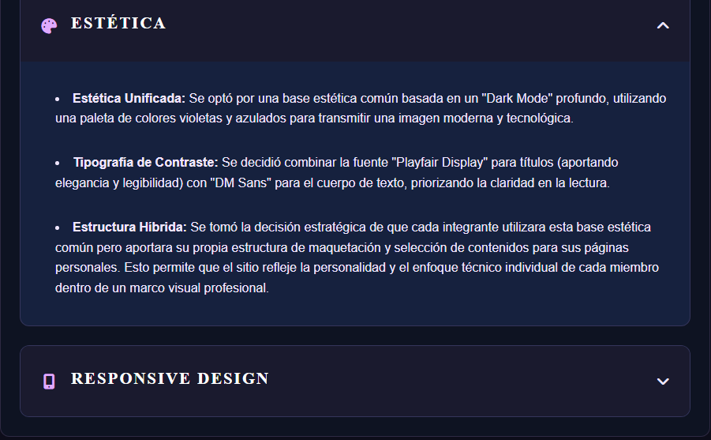
</p>

**2. Contador Animado de Estadísticas**

**Ubicación** Estadísticas del Proyecto.
**Descripción:** Al cargar la página, los números de las estadísticas (páginas, archivos, scripts) realizan un conteo ascendente desde 0 hasta el valor objetivo definido en el atributo data-target, utilizando una transición fluida de aproximadamente 1 segundo.

**Captura:**

<p style="text-align: center;">
  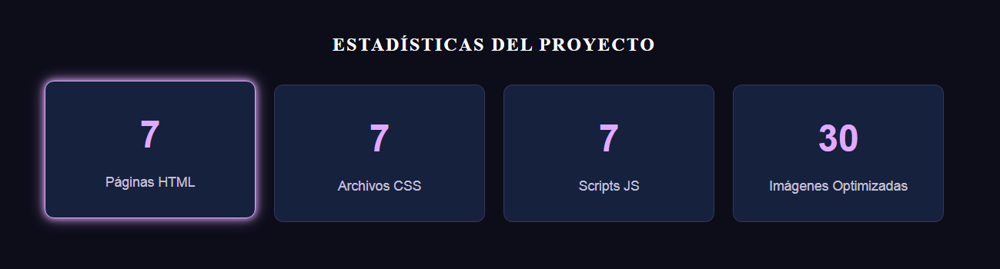
</p>

<details>

<summary> <h3>Funciones dinámicas implementadas en las páginas individuales </h3></summary>

#### TOMÁS (tomas.js)

**1. Revelación de Información Extra**

**Ubicación:** Sección (#sobre-mi)
**Descripción:** Al activarse el evento click, el script verifica el estado de visualización del contenedor #info-extra. Si está oculto (display: none), lo muestra y cambia el texto del botón; de lo contrario, lo oculta nuevamente.

**Captura:**

  <p style="text-align: center;">
  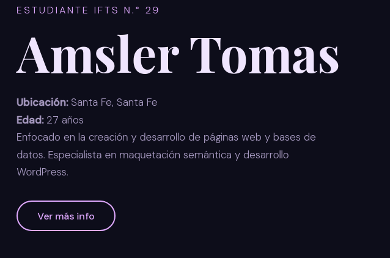
</p>

<p style="text-align: center;">
  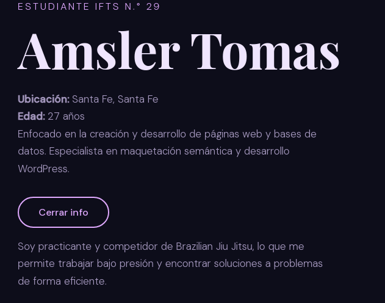
</p>

**2. Menú Navegación**

**Ubicación:** Encabezado.
**Descripción:** Se integró la lógica en main.js para el funcionamiento del menú hamburguesa (nav-toggle) en dispositivos móviles, asegurando que el menú se cierre automáticamente al seleccionar una sección.

**Captura:**

 <p style="text-align: center;">
  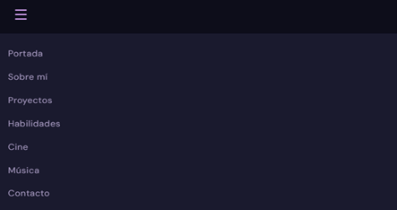
</p>

#### RODRIGO (rodrigo.js)

**1. Menú Lateral Desplegable (Hamburguesa)**

**Ubicación:** Encabezado.
**Descripción:** Permite abrir y cerrar el menú de navegación en dispositivos móviles al alternar la clase .open en el contenedor del menú. Además, incluye una lógica para cerrar automáticamente el menú cuando el usuario hace clic en cualquier enlace de sección.

**Captura:**

 <p style="text-align: center;">
  
</p>

**2. Revelación de Información Extra**

**Ubicación:** Sección Sobre Mí (#sobre-mi).
**Descripción:** Al hacer clic en el botón "Ver más info", se despliega un bloque de texto oculto que contiene detalles adicionales sobre la faceta creativa del perfil. El texto del botón cambia dinámicamente a "Cerrar info" cuando el contenido está visible.

**Capturas:**

  <p style="text-align: center;">
  
</p>

<p style="text-align: center;">
  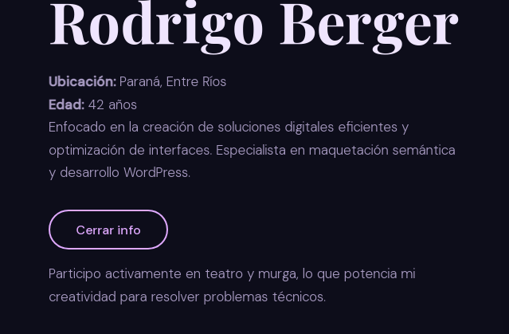
</p>
  
**3. Navegación por Anclas**

**Ubicación:** Menú de navegación (#nav-menu).
**Descripción:** Utiliza identificadores de fragmento (ej. #proyectos, #habilidades) para permitir que el usuario se desplace directamente a las diferentes categorías de información dentro de la misma página.

**Captura:**

  <p style="text-align: center;">
  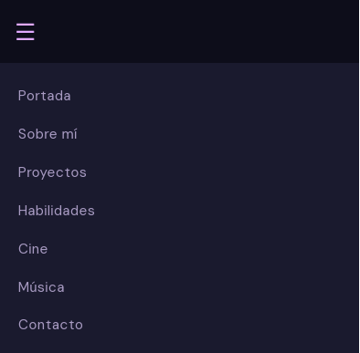
</p>

#### MARIANA (mariana.js)

**1. Sistema de Acordeón (Secciones Desplegables)**
**Ubicación:** Secciones de "Películas Favoritas" y "Discos Favoritos".
**Descripción:** La función toggleSection alterna la visibilidad de los contenedores y aplica una rotación de 180° a los iconos de flecha. Permite mantener el diseño limpio y compacto.

**Capturas:**

  <p style="text-align: center;">
  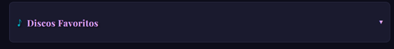
</p>

<p style="text-align: center;">
  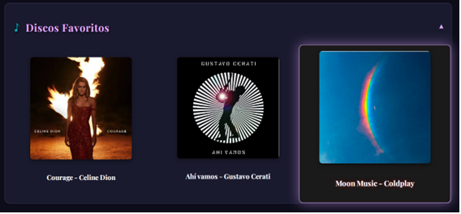
</p>

**2. Efecto de Enfoque "Sobresalir" (Hover & Click)**

**Ubicación:** Galería de ítems dentro de las secciones desplegables.
**Descripción:** Al hacer clic en un ítem (película o disco), JavaScript aplica la clase .sobresalir. Esto activa una transformación de escala (1.1x) y un resplandor de neón rojo, adelantando tanto la imagen como el texto descriptivo simultáneamente.

**Captura:**

  <p style="text-align: center;">
  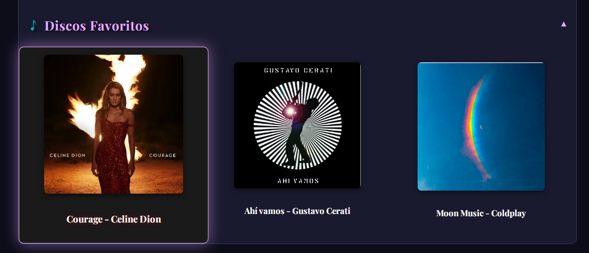
</p>

**3. Validación de Formulario**

**Ubicación:** Sección de Contacto (Pie de página).
**Descripción:** Captura el evento submit, previene la recarga de la página mediante e.preventDefault(), muestra una alerta de confirmación al usuario y limpia los campos automáticamente con el método .reset().

**Captura:**

  <p style="text-align: center;">
  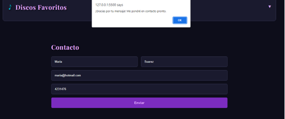
</p>

**4.Lógica de Cierre Global e Interrupción**

**Ubicación:** Todo el documento.
**Descripción:** Se implementó e.stopPropagation() para evitar conflictos entre los clics de las imágenes y los contenedores padres. Además, un evento global cierra cualquier ítem resaltado al hacer clic en el fondo de la página.

#### GIMENA (gimena.js)

**1. Destacar la sección actual o activa**

**Ubicación:** Menú.
**Descripción:** Resalta el enlace del menú que corresponde a la sección en la página. Al desplazarse por la página, el código detecta en qué sección se encuentra y marca el enlace correspondiente en el menú para que se destaque.

**Captura:**

<p style="text-align: center;">
  
</p>

<p style="text-align: center;">
  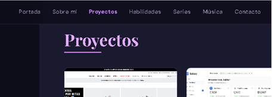
</p>

**2. Menú hamburguesa**

**Ubicación:** Encabezado.
**Descripción:** Permite que el menú de navegación se abra y se cierre cuando se presiona el botón con el ícono de hamburguesa. Al hacer clic en el botón, se agrega o quita una clase que hace que el menú aparezca o desaparezca.

**Capturas:**

<p style="text-align: center;">
  
</p>

<p style="text-align: center;">
  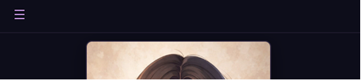
</p>

<p style="text-align: center;">
  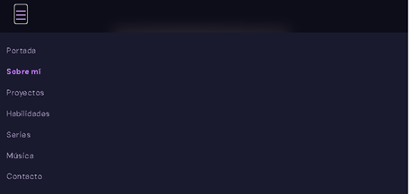
</p>

#### ALEJANDRA (alejandra.js)

**1. Menú hamburguesa**

**Ubicación:** Encabezado
**Descripción:** Permite que el menú de navegación se abra y se cierre cuando se presiona el botón con el ícono de hamburguesa. Al hacer clic en el botón, se agrega o quita una clase que hace que el menú aparezca o desaparezca.

**Capturas:**

<p style="text-align: center;">
  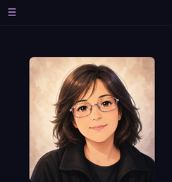
</p>

<p style="text-align: center;">
  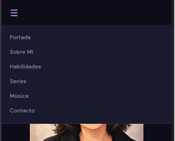
</p>

**2. Revelación de Información Extra**

**Ubicación:** Sección Sobre Mí (#sobre-mi).
**Descripción:** Al hacer clic en el botón "Ver más info", se despliega un bloque de texto oculto que contiene detalles adicionales sobre la faceta creativa del perfil. El texto del botón cambia dinámicamente a "Cerrar info" cuando el contenido está visible.

**Capturas:**

  <p style="text-align: center;">
  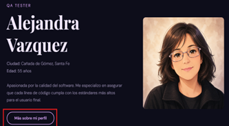
</p>

<p style="text-align: center;">
  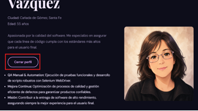
</p>

## </details>

---

## Uso de Inteligencia Artificial (IA).

#### Herramientas y Modelos Utilizados

**Página principal**

**Gemini 3 Flash (Google)**: Modelo principal utilizado para la generación de lógica avanzada en JavaScript, depuración de errores de renderizado y redacción de textos técnicos para la bitácora.
**ChatGPT (OpenAI)**: sugerencias de diseño CSS responsivo.

**Uso en Código y Lógica (JavaScript/CSS)**
El uso de la IA fue fundamental para resolver problemas de lógica que excedían el comportamiento estándar de CSS:

1.  **Lógica de "Text Scramble"**:

    - Se utilizó la IA para crear un algoritmo que reemplaza caracteres de forma aleatoria basándose en un array de símbolos (`!<>-_/[]{}—=+*^?#`) hasta revelar el texto final.
    - **Problema resuelto**: Se logró una transición fluida entre frases de diferentes longitudes sin romper la estructura del encabezado.

2.  **Efecto Magnético Avanzado**:

    - La IA ayudó a implementar cálculos matemáticos de distancia euclidiana para que los elementos de la sección de tecnologías reaccionen a la posición del cursor (`mouseX`, `mouseY`).
    - **Optimización de Rendimiento**: Se integró `requestAnimationFrame` por sugerencia de la IA para evitar que los cálculos constantes saturaran el procesador del navegador, garantizando una animación a 60fps.

3.  **Depuración (Debugging)**:

    - **Carga del DOM**: Resolución del error `TypeError: cannot read property of null` mediante la implementación de funciones autoejecutables y validaciones preventivas (`if (!heading) return`).

<details>

<summary><h3>IA utilizada por los integrantes del equipo</h3> </summary>

**TOMÁS**

**Herramientas Utilizada: Gemini 3 PRO (Google)**
**Uso en Contenido:** Redacción y síntesis de descripciones para las secciones de proyectos y experiencia profesional, manteniendo un tono formal e institucional. Asistencia en la redacción de la bitácora de desarrollo y este documento técnico.
**Uso en Código y Lógica:** Refactorización: Adaptación de la estructura HTML del proyecto anterior a la nueva arquitectura grupal, migrando selectores antiguos a las nuevas variables de CSS (--fondo, --acento) y fuentes del equipo (Playfair Display y DM Sans).
Debugging: Resolución de errores de permisos y visualización durante el despliegue en GitHub Pages y Vercel, y optimización de la alineación de tarjetas mediante propiedades avanzadas de CSS como object-fit y flex-grow.
**Imágenes:** Se utilizaron prompts específicos para la selección y ajuste de dimensiones de los posters de películas y carátulas de discos, garantizando la armonía visual del sitio.

**RODRIGO**

**Herramienta utilizada: Gemini 1.5 Flash (Google)**
**Uso en Contenido:** Redacción y síntesis de descripciones para las secciones de proyectos y experiencia profesional, manteniendo un tono formal e institucional. Asistencia en la redacción de la bitácora de desarrollo y este documento técnico.
**Uso en Código y Lógica:** Refactorización: Adaptación de la estructura HTML del proyecto anterior a la nueva arquitectura grupal, migrando selectores antiguos a las nuevas variables de CSS (--fondo, --acento) y fuentes del equipo (Playfair Display y DM Sans).
Debugging: Resolución de errores de permisos y visualización durante el despliegue en GitHub Pages y Vercel, y optimización de la alineación de tarjetas mediante propiedades avanzadas de CSS como object-fit y flex-grow.
**Imágenes:** Se utilizaron prompts específicos para la selección y ajuste de dimensiones de los posters de películas y carátulas de discos, garantizando la armonía visual del sitio.

**MARIANA**
**Herramientas utilizadas:**

- **Gemini 3 Flash (Google)**
  **Uso de IA en Lógica de Formulario de Contacto:** Se implementaron mejoras para lograr una interacción más fluida y segura en el formulario. Se evitó el comportamiento nativo del envío con e.preventDefault() para impedir la recarga de la página y mostrar confirmaciones sin interrupciones. Además, se utilizó this.reset() para limpiar los campos tras el envío, dejando el formulario listo para reutilizar. Por último, se agregó una validación (if (formContacto)) para prevenir errores en páginas donde el formulario no existe, asegurando un código más robusto y reutilizable.
- **ChatGPT GPT-5.3 (OpenAI)**: Sugerencias de diseño CSS responsivo.

**GIMENA**

**Herramienta utilizada: Claude Sonnet 4.6**
**Organización del código:** Utilicé herramientas de inteligencia artificial para ayudar a organizar y estructurar el CSS y HTML, asegurando que el código sea más legible, limpio y consistente.
**Optimización del diseño:** La IA me apoyó en la creación de una estructura eficiente para el diseño responsivo, ajustando los estilos a diferentes tamaños de pantalla.

**ALEJANDRA**

**Herramientas utilizadas: Gemini 3 Flash / ChatGPT GPT-5.3**
**Interactividad del Perfil ("Sobre Mí"):** Se desarrolló una función en JavaScript que alterna clases dinámicas. Se incorporó scrollIntoView con comportamiento smooth para garantizar que, tras el despliegue, el usuario sea guiado automáticamente al final del contenido.
**Debugging de Especificidad en Media Queries:** Sugerencias de diseño CSS responsivo.
**Generación de Contenido:**Asistencia de la IA para redactar las descripciones de las secciones de "Series" y "Música". El criterio fue vincular gustos personales (como CSI o Dr. House) con habilidades propias del rol de QA, resaltando capacidades de análisis forense de datos, lógica deductiva y atención al detalle.

### IA utilizada para generar avatares

Nos pusimos de acuerdo en utilizar una imagen real con el siguiente prompt: "Recrea esta imagen con estilo anime o caricatura" y utilizamos diferentes IA para lograrlo:

- Tomás, Rodrigo y Alejandra: Nano Banana (Gemini)
- Gimena y Mariana: ChatGPT GPT-5.3

</details>

---

### Enlaces

**Repositorio GitHub**: [\[link al repo\] ](https://github.com/)

**Deploy en Vercel**: [\[link al sitio\] ](https://)
